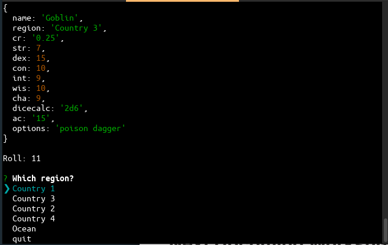

# DDRandomizer

### Purpose
Command line tool to provide a character with random stats from a selected region for a Dungeons & Dragons the Dungeon Master (game organizer). 

### Getting Started
  - Must have Node.js installed
  - Create a spreadsheat and save as input.csv in root folder (see below, "Creating Spreadsheet")
  - Run the following command from the root folder
 ```
$ node app.js
```
  - Select a region, A character with randomized stats and a dice roll based on character's "dicecalc" will be displayed.
 

#### Creating Spreadsheet
Each row is a character. Attributes are determined by column headers 
##### Column headers:
 
   - Required: region - a list of regions, separated by semicolons, that a character might be found in. 
  - Required: dicecalc - {number of dice} d {number of sides}
  - Each character stat must have two columns (Min/Max) Ex: STR Min / STR Max
  - All other columns are optional
  - Any column with a list separated by semicolons (except for region) - A random item from list will be displayed with character
 
  ### Use
  - You will be prompted to select a region. 
  -- List of regions is all characters' regions combined
  - You will be provided all the information for a random character from that region
  - All stats provided in input.csv will be randomized in the bounds given (ATR Min / ATR Max)
  - A dice roll will be generated from the characters "dicecalc" 


# Contact

If you would like to request new features please contact me: jacobzirbel@gmail.com

